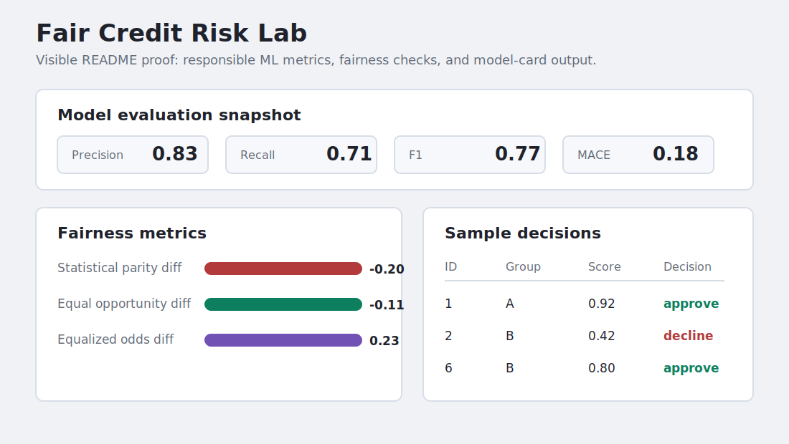

# Fair Credit Risk Lab

A responsible AI project for credit risk modelling, calibration checks, and fairness evaluation on tabular data.

This is a new public portfolio project that demonstrates practical ML engineering without paid APIs.



## Output Proof

- The loop above is visible directly in the GitHub README when the repository opens.
- Open [demo/index.html](demo/index.html) only if you want the larger standalone demo page.
- Review [sample_outputs/fairness_report.json](sample_outputs/fairness_report.json) for a concrete evaluation report.
- See [docs/demo.md](docs/demo.md) for what the demo proves.

## What This Demonstrates

- End-to-end tabular ML workflow design.
- Fairness metric implementation and testing.
- Calibration-aware model evaluation.
- Stakeholder-facing dashboard and model-card documentation.
- Reproducible local project structure.

## Features

- Load a credit risk CSV dataset.
- Train simple baseline models with scikit-learn when installed.
- Compute precision, recall, F1, ROC-AUC-ready outputs, calibration bins, and fairness metrics.
- Compare approval rates and error-rate gaps across protected groups.
- Generate model-card-ready JSON summaries.
- Streamlit dashboard entrypoint for stakeholder review.

## Local Setup

```bash
python -m venv .venv
.venv\Scripts\activate
pip install -e ".[dev]"
pytest
```

Run the dashboard:

```bash
streamlit run src/fair_credit/app.py
```

## Sample Data

The included sample data is synthetic and safe for public use. It is only for demonstration and tests.

## Limitations

- The included data is intentionally small and synthetic.
- Production use would require a stronger validation strategy, larger data, drift checks, and governance review.
- XGBoost is optional and not required for the core project.
