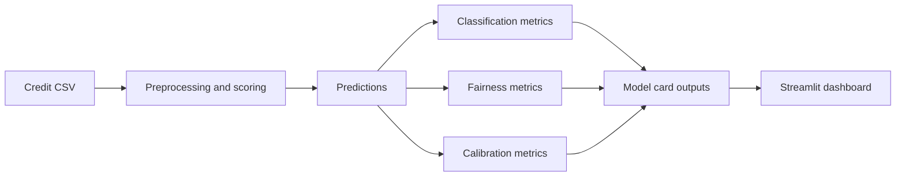

# Architecture

## Design Notes

- The first version uses synthetic public data so the repository is safe to publish.
- Metric functions are implemented in plain Python to make the fairness logic inspectable.
- The model layer can later be extended with scikit-learn and XGBoost experiments.

